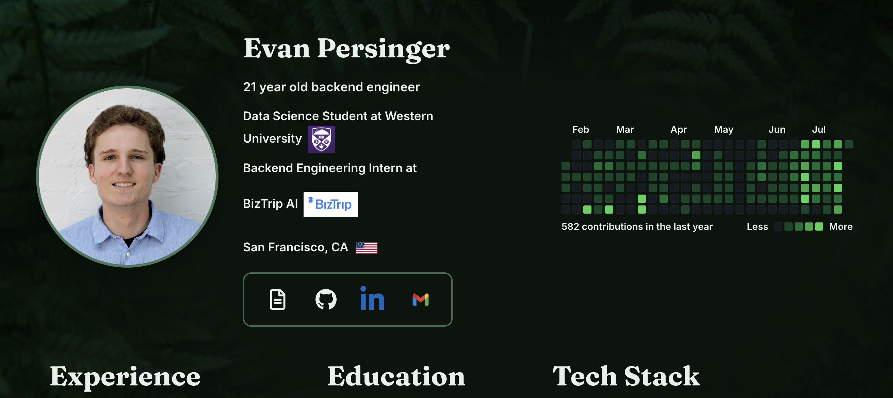

A personal portfolio website built with Next.js, React, and TypeScript.

## Tech Stack

- Next.js (App Router)
- React
- TypeScript
- CSS3
- pnpm (package manager)

## San Francisco map data

`src/components/sf-map-data.json` (used by `LocationMap.tsx`) is precomputed from
public-domain US Census Bureau TIGER/Line data (roads + water for San Francisco
County, FIPS 06075), no map tile service or API key involved. Shapefiles were
simplified with `mapshaper` and projected to SVG paths with `d3-geo` in a one-off
script, not part of this repo. To regenerate: re-download the TIGER/Line
roads/areawater shapefiles for FIPS 06075, simplify with mapshaper, and re-run the
same d3-geo `fitExtent`/`geoPath` projection step.

## Deployment

Live at [portfolio-sable-seven-14.vercel.app](https://portfolio-sable-seven-14.vercel.app/), deployed on Vercel.
